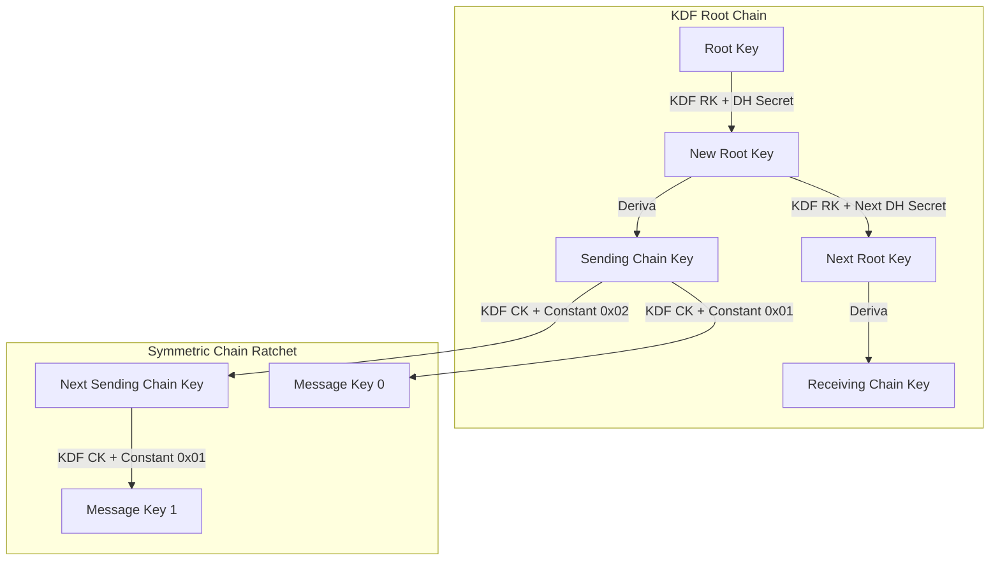

# Apresentação do Projeto: O "Signal" Simplificado (E2EE P2P com Double Ratchet)

Este documento explica de forma detalhada e didática o funcionamento do **Algoritmo Double Ratchet** (usado no Signal e WhatsApp) e descreve como realizar a demonstração prática do chat criptografado de ponta a ponta (E2EE) construído em Python.

---

## 1. O que é o Double Ratchet?

O **Double Ratchet Algorithm** é um protocolo criptográfico de troca de chaves projetado para garantir confidencialidade de ponta a ponta (E2EE) em sessões de mensagens assíncronas. Ele foi desenvolvido por Trevor Perrin e Moxie Marlinspike em 2013 para o aplicativo Signal.

Ele resolve dois grandes problemas da comunicação segura:
1. **Perfect Forward Secrecy (PFS) - Sigilo de Encaminhamento Perfeito**: Se um atacante comprometer a chave de criptografia de hoje, ele **não conseguirá descriptografar** as mensagens enviadas no passado.
2. **Post-Compromise Security (Break-in Recovery) - Segurança Pós-Compromisso**: Se um atacante descobrir a chave de criptografia de hoje, o protocolo se recupera de forma autônoma após algumas trocas de mensagens, impedindo que o atacante continue lendo as mensagens futuras.

---

## 2. Conceitos Fundamentais

O algoritmo funciona combinando dois tipos de "catracas" (ratchets) de chaves:

### A. Catraca Simétrica (Symmetric Ratchet)
Toda vez que uma mensagem é enviada ou recebida, uma função de derivação de chaves (**KDF - Key Derivation Function**) baseada em HMAC-SHA256 avança a chave da cadeia (Chain Key) para produzir uma nova chave de mensagem (Message Key) e uma nova chave de cadeia.

*   A chave de mensagem é usada uma única vez para encriptar/decriptar a mensagem e depois é apagada da memória.
*   Como a KDF é uma função unidirecional (one-way), saber a chave de cadeia de hoje não permite reconstruir as chaves de cadeia ou de mensagem do passado. Isso garante o **Perfect Forward Secrecy**.

### B. Catraca Diffie-Hellman (DH Ratchet)
Quando há uma resposta do interlocutor, as chaves públicas Diffie-Hellman (baseadas em curvas elípticas, usando a curva **X25519** no nosso código) são trocadas.
*   Isso gera um novo segredo compartilhado (shared secret) que alimenta a catraca do topo (Root KDF).
*   A Root KDF gera novas chaves de cadeia de envio e recebimento.
*   Como o atacante não possui a chave privada de nenhuma das partes, ele é incapaz de calcular o segredo Diffie-Hellman, perdendo o acesso mesmo se tivesse comprometido o estado anterior da catraca simétrica. Isso garante a **Segurança Pós-Compromisso**.

---

## 3. Funcionamento Visual do Algoritmo



A cada resposta recebida de um par, uma nova troca DH ocorre, mudando o **Root Key** e criando uma nova cadeia simétrica. Dentro da mesma cadeia simétrica, as chaves avançam a cada mensagem enviada ou recebida.

---

## 4. Estrutura do Código Criado

O projeto foi dividido de forma modular para facilitar a legibilidade:

1.  **[double_ratchet.py](file:///Users/vini/projects/dcc075/trab-2/double_ratchet.py)**: Contém o coração criptográfico. Define a classe `DoubleRatchet` com a lógica de rotação da Root Key via HKDF-SHA256, rotação de Chain Keys via HMAC-SHA256, encriptação/decriptação autenticada com AES-256-GCM e o tratamento de chaves de mensagens fora de ordem (`MKSKIPPED`).
2.  **[server.py](file:///Users/vini/projects/dcc075/trab-2/server.py)**: O servidor de sockets que faz o papel de intermediário. Ele armazena as chaves públicas iniciais dos clientes, entrega mensagens offline e encaminha as mensagens cifradas. **Importante:** O servidor não tem acesso às chaves privadas dos clientes, provando a confidencialidade ponta-a-ponta.
3.  **[client.py](file:///Users/vini/projects/dcc075/trab-2/client.py)**: Cliente de chat de terminal interativo. Ele gera as chaves DH locais e exibe painéis coloridos atualizando o estado de todas as chaves (Root Key, Chain Keys, Message Keys) em tempo real conforme envia e recebe mensagens.
4.  **[demo.py](file:///Users/vini/projects/dcc075/trab-2/demo.py)**: Script automatizado de demonstração que executa o servidor, a Alice e o Bob de forma concorrente em threads, mostrando o protocolo rodando perfeitamente e imprimindo o status passo a passo, incluindo um teste de mensagens entregues fora de ordem.

---

## 5. Como Demonstrar (Guia de Roteiro)

Você pode demonstrar o funcionamento de duas maneiras: através da **Simulação Automatizada** (rápida e controlada) ou do **Chat Interativo Multi-Terminal** (mostrando a comunicação de rede real).

### A. Demonstração 1: Simulação Automatizada (Recomendado para apresentação rápida)

Execute no terminal:
```bash
python3 demo.py
```

**Roteiro da Apresentação Automatizada:**
1.  **Registro**: O script inicia o servidor e registra Alice e Bob, fazendo o upload de suas chaves públicas iniciais para o diretório do servidor.
2.  **Alice envia Mensagem 1**: Alice envia "Olá Bob! Tudo bem?". A catraca simétrica dela avança. O console exibe a chave de mensagem (MK) gerada.
3.  **Visualização no Servidor**: O servidor intercepta e exibe a mensagem cifrada em formato Hexadecimal (Ciphertext e Nonce). O servidor explicitamente loga que **não consegue decriptar** o texto pois não possui as chaves privadas.
4.  **Bob recebe Mensagem 1**: Bob recebe a mensagem de Alice. Como é a primeira mensagem, ele usa seu par de chaves inicial, executa o cálculo Diffie-Hellman com a chave pública contida no cabeçalho da Alice e cria sua catraca de recebimento, descriptografando a mensagem com sucesso.
5.  **Alice envia Mensagem 2 e 3**: Como Alice não recebeu respostas, ela continua usando a mesma cadeia simétrica. Note no console que a chave pública DH dela permanece a mesma, porém as **Chain Keys** e **Message Keys** rotacionam a cada mensagem (PFS em ação).
6.  **Bob responde Alice**: Bob envia uma resposta. Bob rotaciona sua chave privada DH local (gerando um novo par de chaves) e calcula um novo segredo com a chave pública da Alice. As chaves mudam drasticamente.
7.  **Alice recebe resposta do Bob**: Alice detecta a nova chave pública de Bob no cabeçalho. Ela rotaciona sua chave local e avança sua catraca DH. Ambas as partes agora estão sincronizadas com novas chaves simétricas.
8.  **Simulação de Mensagens Fora de Ordem**: O script simula uma perda de pacote na rede. Alice envia as mensagens 1, 2 e 3. Bob recebe a mensagem 3 antes da 1 e 2.
    *   Bob percebe que o contador de mensagens avançou duas posições à frente.
    *   Bob calcula as chaves de mensagem para as mensagens 1 e 2, guarda-as temporariamente em uma estrutura segura em memória (`MKSKIPPED`) e descriptografa a mensagem 3 instantaneamente.
    *   Quando as mensagens atrasadas 1 e 2 finalmente chegam, Bob recupera as chaves salvas do buffer, descriptografa as mensagens com sucesso e remove as chaves da memória para garantir o sigilo futuro.

---

### B. Demonstração 2: Chat Interativo Multi-Terminal (Demonstração prática em tempo real)

Abra três terminais diferentes para rodar o chat interativo.

1.  **Terminal 1 (Servidor)**:
    ```bash
    python3 server.py
    ```
2.  **Terminal 2 (Cliente Bob)**:
    ```bash
    python3 client.py
    Bob
    ```
3.  **Terminal 3 (Cliente Alice)**:
    ```bash
    python3 client.py
    Alice
    ```

**Roteiro do Chat Interativo:**
1.  No terminal do Bob, você verá que ele registrou sua chave pública no servidor.
2.  No terminal da Alice, digite `/list` para ver os usuários online (deve listar `Alice` e `Bob`).
3.  No terminal da Alice, digite `/chat Bob` para iniciar a sessão criptografada. O console informará que a chave pública inicial de Bob foi recuperada do servidor e o canal E2EE foi criado.
4.  Alice digita uma mensagem interativa (ex: `Olá Bob!`).
5.  Veja nos logs da Alice e do Bob as tabelas coloridas atualizando os segredos.
6.  Observe no terminal do Servidor o bloco indicando a mensagem recebida cifrada, as informações de cabeçalho (`dh`, `pn`, `n`) e a verificação de que o servidor não possui acesso ao conteúdo.
7.  Faça o Bob responder à Alice digitando `/chat Alice` (caso ainda não esteja no chat) seguido de uma mensagem. A catraca Diffie-Hellman rotacionará imediatamente as chaves principais nas duas pontas.

---

## 6. O que essa demonstração prova criptograficamente?

*   **Verificação de PFS (Perfect Forward Secrecy)**: Se você roubar a chave de mensagem de ontem, ela é inútil para descriptografar a mensagem de hoje porque a chave da cadeia avançou unidirecionalmente.
*   **Isolamento do Servidor**: O servidor só conhece metadados de roteamento (quem envia para quem) e chaves públicas de inicialização. As conversas reais são ininteligíveis para ele.
*   **Recuperação de Chave Privada Comprometida (Break-in Recovery)**: A catraca DH rotaciona de forma independente das catracas simétricas. Se um atacante comprometer a chave simétrica de um cliente em determinado ponto, a próxima resposta legítima de um par irá redefinir o canal com novas chaves derivadas de segredos Diffie-Hellman que o atacante desconhece.
